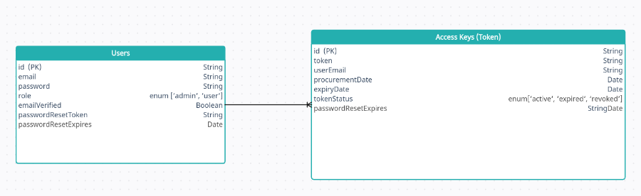

# Access Key Manager

## Project Objective
Micro-Focus Inc., a software company, has built a school management platform that is multitenant, allowing various schools to set up on the platform as though it was built specifically for them. Instead of building payment features into the school software, they have decided to use an access key-based approach to monetize it. They have outsourced the project to build a key manager, a web application that schools can use to purchase access keys to activate their school accounts.

## Customer Requirements

### School IT Personnel
1. Should be able to sign up and log in with an email and password, with account verification.
2. There should be a reset password feature to recover lost passwords.
3. Should be able to see a list of all access keys granted: active, expired, or revoked.
4. For each access key, the personnel should be able to see the status, date of procurement, and expiry date.
5. A user should not be able to get a new key if there is an active key already assigned to him/her. Only one key can be active at a time.

### Micro-Focus Admin
1. Should be able to log in with an email and password.
2. Should be able to manually revoke a key.
3. Should be able to see all keys generated on the platform and see the status, date of procurement, and expiry date.
4. Should be able to access an endpoint, such that if the school email is provided, the endpoint should return status code 200 and details of the active key if any is found, else it should return 404. This is to enable them to integrate their school software with the key manager.

## Deliverables
- Web application source code (GitHub - implement Git flow with a reasonable number of commits including a well-written README file)
- 
## Deployed link
- [(access-key-management.vercel.app)](https://access-key-management.vercel.app/)
